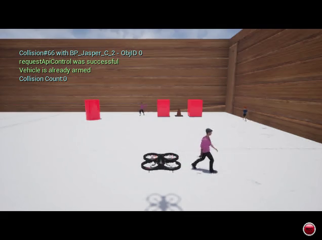
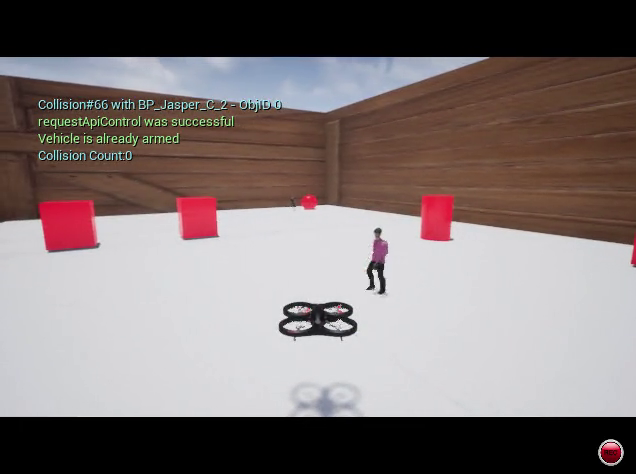

## Unreal Engine
For problems in dynamic collision avoidance, the following map with walking human characters can be used to gather data to train a RL agent. The human characters are set to walk on designed spline paths which can be customised in the .uproj file in the Unreal Editor. The compiled Unreal project is available at this gdrive link: [here](https://drive.google.com/drive/folders/1ZYeQIaZDmKPVhS7VEsjHF7_miHy66nuY?usp=sharing). The project uses the Microsoft AirSIM plugin for the quadcopter and all the asset files can be accessed in the Contents folder.

